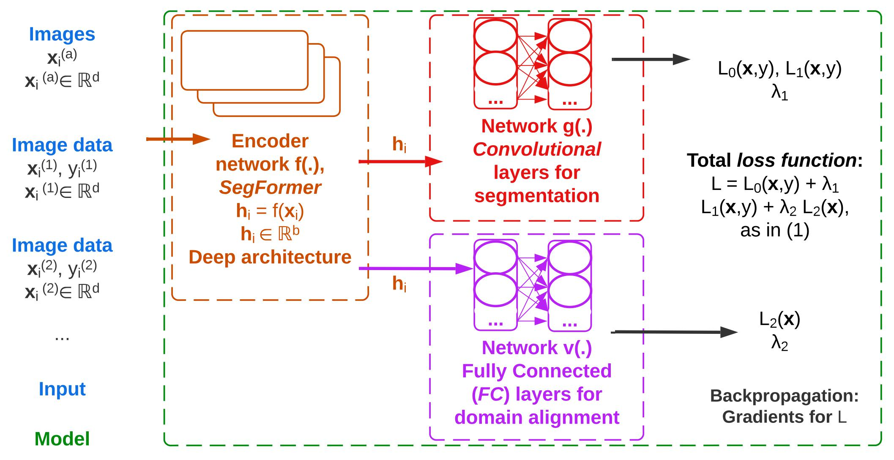
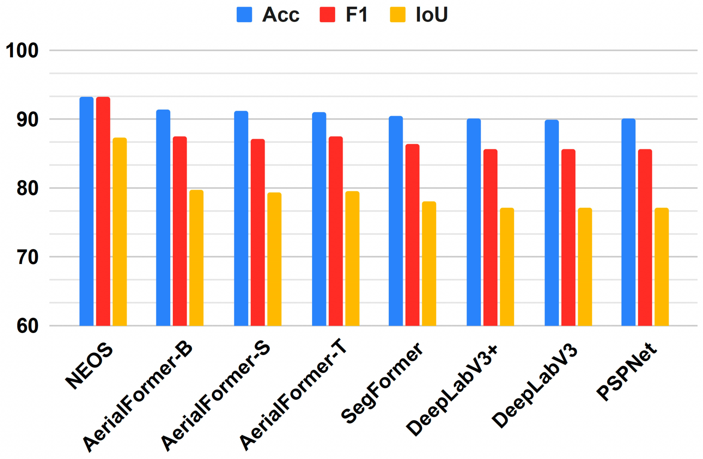

# Learning_from_Unlabeled_Data_for_Domain_Adaptation_for_Semantic_Segmentation
Learning from Unlabeled Data: Domain Adaptation for Semantic Segmentation

Paper: [http://arxiv.org/pdf/2404.11299.pdf](http://arxiv.org/pdf/2404.11299.pdf) - arXiv:2404.11299

GitHub repository of the paper: "Learning from Unlabelled Data with Transformers: Domain Adaptation for Semantic Segmentation of High Resolution Aerial Images"

Authors: Nikolaos Dionelis*, Francesco Pro#, Luca Maiano#, Irene Amerini#, Bertrand Le Saux*

Affiliation: (1) *European Space Agency (ESA), ESRIN, Φ-lab, Italy, and

(2) #Sapienza University of Rome, Italy

Related paper: [http://arxiv.org/pdf/2404.11302.pdf](http://arxiv.org/pdf/2404.11302.pdf) - arXiv:2404.11302

Related website: [Click here](http://scholar.google.com/citations?hl=en&user=2UweGHoAAAAJ&view_op=list_works&sortby=pubdate)

Non-annotated Earth Observation Semantic Segmentation (NEOS) model

## Abstract of Paper:

Data from satellites or aerial vehicles are most of the times unlabelled. Annotating such data accurately is difficult, requires expertise, and is costly in terms of time. Even if Earth Observation (EO) data were correctly labelled, labels might change over time. Learning from unlabelled data within a semi-supervised learning framework for segmentation of aerial images is challenging. In this paper, we develop a new model for semantic segmentation of unlabelled images, the Non-annotated Earth Observation Semantic Segmentation (NEOS) model. NEOS performs domain adaptation as the target domain does not have ground truth masks. The distribution inconsistencies between the target and source domains are due to differences in acquisition scenes, environment conditions, sensors, and times. Our model aligns the learned representations of the different domains to make them coincide. The evaluation results show that it is successful and outperforms other models for semantic segmentation of unlabelled data.

Index Terms - Semantic segmentation, Unlabelled data, Domain adaptation, Aerial images

## Flowchart Diagram:



Figure 1: Flowchart of the proposed model NEOS for semantic segmentation of unlabelled data using domain adaptation.

## Brief Discussion about the Model:

We develop a model for semantic segmentation of unlabelled aerial images, the Non-annotated Earth Observation Semantic Segmentation (NEOS) model. To address the problem of performing accurate semantic segmentation on unlabelled image data, the model NEOS performs domain adaptation. NEOS makes the learned latent representations of the different domains to coincide. This is achieved by minimizing a loss function that makes the network to align the latent features of the different domains. Our main contribution is the development of a model for semantic segmentation of aerial images that do not have ground truth segmentation masks, performing domain adaptation.

## Usage:

For the evaluation of the proposed model NEOS, we use the dataset CVUSA, which is unlabelled, as well as the datasets Potsdam and Vaihingen, which are labelled. We use the CVUSA aerial images. In the paper, we also use the labelled dataset CityScapes for the CVUSA street images.

Tested with: Python 3.10.13

Code in PyTorch

We have used the Visual Studio Code IDE Code Editor.

Download the dataset CVUSA, as well as the datasets Potsdam and Vaihingen. Also, download the dataset CityScapes.

The image datasets have to be stored in folders so that the training and the testing/ inference of the model NEOS is performed, as described in the paper.

Example usage:

Run from the Terminal:

```
cd ./src/
python train.py
```

## Further Usage Information:

This GitHub code repository contains a PyTorch implementation for the model NEOS.

To install the required libraries: Run "pip install -r requirements.txt" from the Terminal.

In Linux, run:
```
git clone <this website.git>
conda create -n modelNEOS python
conda info --envs
conda activate modelNEOS
pip install --user --requirement requirements.txt
```

## NEOS Results

The main results and the key outcomes of the proposed model NEOS can be found in the paper "Learning from Unlabelled Data with Transformers: Domain Adaptation for Semantic Segmentation of High Resolution Aerial Images".

Results of NEOS using the source code:



## Acknowledgement:

All the acknowledgements, references, and citations for the model NEOS can be found in the paper "Learning from Unlabelled Data with Transformers: Domain Adaptation for Semantic Segmentation of High Resolution Aerial Images".

## If you use our code, please cite:

Nikolaos Dionelis, Francesco Pro, Luca Maiano, Irene Amerini, and Bertrand Le Saux, "Learning from Unlabelled Data with Transformers: Domain Adaptation for Semantic Segmentation of High Resolution Aerial Images," To appear, 2023.

```
@misc{dionelis2023,
  title        = "Learning from Unlabelled Data with Transformers: Domain Adaptation for Semantic Segmentation of High Resolution Aerial Images",
  author       = "Nikolaos Dionelis and Francesco Pro and Luca Maiano and Irene Amerini and Bertrand Le Saux",
  year         = 2023,
  note         = "To appear"
}
```

If you would like to get in touch, please contact: [Nikolaos.Dionelis@esa.int](mailto:Nikolaos.Dionelis@esa.int?subject=[GitHub]).

## Further Information

Paper: "Learning from Unlabelled Data with Transformers: Domain Adaptation for Semantic Segmentation of High Resolution Aerial Images"

Submitted to: IEEE International Geoscience and Remote Sensing Symposium (IGARSS 2024) - [IGARSS, Athens](http://www.2024.ieeeigarss.org)

European Space Agency (ESA), ESRIN, Φ-lab, Italy: [ESA Φ-lab](http://philab.esa.int)

Sapienza University of Rome, Italy: [Sapienza University of Rome](http://www.uniroma1.it/en/pagina-strutturale/home)


